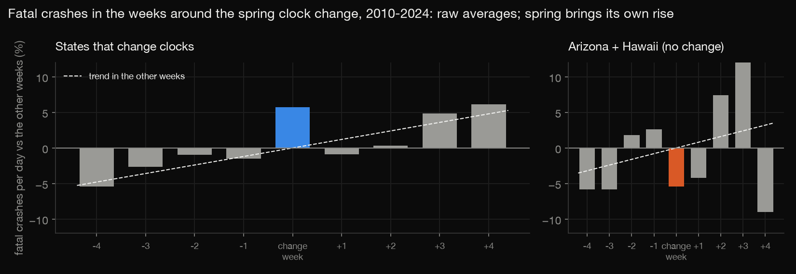
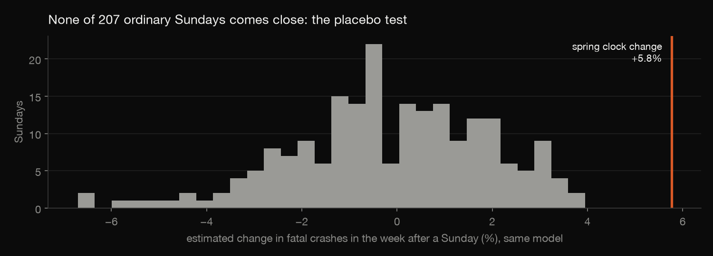
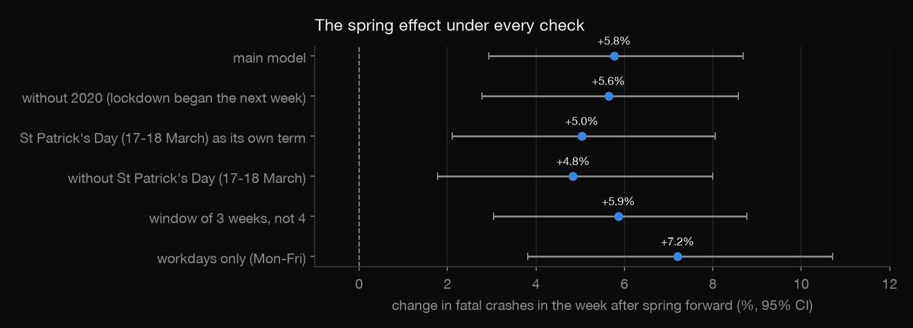
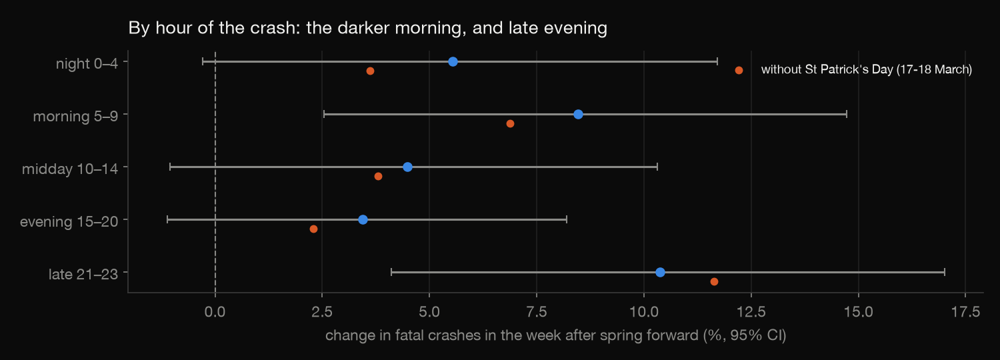

# Does the spring clock change cause fatal crashes?

Each March most of the US moves its clocks forward an hour: a short night of sleep, and darker mornings for weeks.
This project tests whether the week after that change has more fatal crashes than it should. It uses every fatal
crash in the country from 2010 to 2024 (FARS, 510,000 crashes), Arizona and Hawaii (which never change their
clocks) as a comparison, and a placebo test on 207 ordinary Sundays.

Build log: https://mrrishit909.github.io/projects/dst-crashes-stats/

## Data

NHTSA Fatality Analysis Reporting System, national CSV files 2010–2024: a census of crashes on public roads in which
someone died within 30 days. `download.py` fetches them; the raw files are not committed. `results/daily.csv` has
daily counts by group and time of day; `results/crashes_by_year.csv` has the yearly totals and the crashes with an
unknown hour. Every crash has a known day.

## Method

For each year, take the four weeks either side of the change. Model the daily count of fatal crashes as:

`crashes ~ week_after + year + day of week + days from the change`

- `week_after` is the 7 days starting on the Sunday of the change.
- The trend term absorbs spring's own rise in crashes.
- Errors are quasi-Poisson, because the counts are overdispersed (dispersion 1.5).
- exp(coefficient) is the rate ratio.

The placebo test runs the identical model around every Sunday at least five weeks from either clock change. That
gives 207 estimates from weeks that had no clock change at all.

## Results

| | Week after the change | 95% CI | p |
|---|---|---|---|
| Spring forward, clock-changing states | **+5.8%** fatal crashes | +2.9% to +8.7% | 0.0001 |
| Spring forward, deaths | +5.6% | +2.7% to +8.6% | 0.0001 |
| Fall back | +0.3% | −2.1% to +2.8% | 0.80 |
| Spring, Arizona + Hawaii (no change) | −5.4% | −16.6% to +7.4% | 0.39 |

**Placebo.** Across 207 ordinary Sundays the "week after" estimates centre on −0.2%, with a largest value of +4.0%.
None reaches +5.8%.

**Robustness.** St. Patrick's Day falls inside the week after the change in 9 of the 15 years, and it is a known
drink-driving night. With 17–18 March left out, the effect is +4.8% (+1.8% to +8.0%). The other checks:

| Check | Effect |
|---|---|
| 2020 dropped (lockdown began the next week) | +5.6% |
| 3-week window | +5.9% |
| workdays only | +7.2% |

**When in the day.** The rise is largest in the morning, 5–9 am (+8.5%; +6.9% without St. Patrick's Day). After the
change those hours are dark again. It is also large late in the evening, 9–11 pm (+10.4%; +11.6% without St.
Patrick's Day), which fits short sleep more than darkness.

## The check

`check.R` refits all 14 models (the main grid and the robustness checks) with R's own `glm(family = quasipoisson)`
from `results/daily.csv`. It matches statsmodels on every coefficient and standard error to 1e-6, and confirms the
spring estimate is above every placebo.

## Not done

- No crash exposure: miles driven by week are not available, so the counts aren't rates per mile.
- Arizona and Hawaii are small (about 3 fatal crashes a day), so the comparison is noisy.
- Arizona's Navajo Nation does observe daylight saving time; it stays in the Arizona group.
- One week only; longer-run effects of the darker mornings are not estimated.
